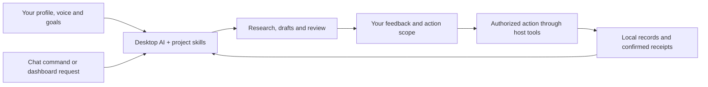

# Social Media Plus ✨

**Turn your experience into useful LinkedIn content and conversations—with AI assistance and control over what happens next.**

A local, open-source editorial and relationship workspace for **Codex** and **Claude Desktop / Cowork**. Bring your preferred desktop AI, choose a folder, and work through a dashboard or ordinary chat commands. Your profile, voice, goals and previous decisions give each session a place to start.

🏠 Local records · 🧠 Your desktop AI · 🎛️ Your rules · 🔓 MIT licensed

**[🚀 Initial setup](docs/getting-started.md) · [⌨️ Commands](SOCIAL_MEDIA_PLUS.md) · [🎨 Personalize](docs/personalization.md) · [🔗 LinkedIn setup](docs/linkedin-setup.md) · [📖 Architecture](docs/architecture.md)**


## 💡 What does this solve?

Building a professional presence often means repeating your background to an AI, correcting generic drafts, juggling tools and trying to remember what you already published or who you spoke with. Social Media Plus puts that work into a durable workspace.

| The friction | How the workspace helps |
| --- | --- |
| Starting from a blank prompt every week | Reuse your profile, objectives, evidence and editorial preferences |
| Drafts that sound like everyone else | Calibrate against your writing samples and save your corrections |
| Ideas scattered across chats | Prepare a week of content with tracked revisions and review |
| Conversations without follow-through | Keep observed relationships, conversation history and follow-up context |
| Unclear approvals or duplicate attempts | Record exact versions, authorization, receipts and uncertain outcomes |
| Guessing what worked | Review supplied performance data and keep missing metrics unavailable |

The AI is the reasoning layer: it researches, proposes, writes and reviews using the tools available in your selected desktop session. Python and SQLite handle deterministic records. **No separate LLM API key, PostgreSQL, Postiz or Docker is required.**

## 🧰 Capabilities

| Capability | What you can do | Availability |
| --- | --- | --- |
| Personal profile and voice | Set audiences, goals, writing style, evidence and privacy boundaries | Included |
| Weekly editorial workflow | Prepare sourced posts, articles and carousel briefs; revise a finished batch | Included workflows; research and asset tools depend on host |
| Five-lens council review | Review an argument from distinct perspectives and preserve dissent | Included roles; sequential fallback when delegation is unavailable |
| Contextual engagement | Find relevant discussions and prepare or send scoped replies | Requires supported browser tools, login and live authorization |
| Content handoff | Review exact content and authorize publishing or scheduling | Browser route depends on host and LinkedIn capabilities |
| Relationship and performance records | Import observations and exports; review actual available metrics | Included; no automatic complete follower or analytics feed |
| Dashboard and durable queue | Request operations and inspect run state | Included |
| Local MCP and portable skills | Connect the queue and workflows to your desktop host | Included; host setup required |
| LinkedIn developer settings | Save two-app configuration in private `.env.local` | Included configuration storage; OAuth/API adapters planned |
| Instagram, YouTube and more | Extend the same workspace to other platforms | Coming soon |

### 🖥️ Inside the application

**Actions:** choose a workflow without remembering every command.


**LinkedIn setup:** configure separate publishing and identity apps using the linked developer guide.


Screenshots show a fresh, empty workspace. **Saving developer credentials does not connect a LinkedIn account.** This release uses an authorized browser session for external LinkedIn actions; direct OAuth/API publishing and analytics adapters are planned.

## 🧠 AI assistance, with explicit control

You decide what the workspace knows, which outcomes matter, what can become public and which actions you authorize. The dashboard saves requests; your desktop agent picks them up, applies the project skills and records the result.



- **Preview when you want suggestions:** `SMP ENGAGE 30 preview` sends nothing.
- **Authorize a bounded session:** `SMP ENGAGE 30` permits the contextual comments and replies documented for that session.
- **Review before scheduling:** `SMP SCHEDULE` covers the exact finished batch presented to you.
- **See what happened:** Runs and stored receipts distinguish queued requests, completed actions and uncertain attempts. Reconcile uncertainty before retrying.
- **Keep your context editable:** change your goals, voice, cadence and boundaries in your own local files.

Installation does not grant standing publishing or outreach permission. Local records remain in your folder; AI inference and browser services may process supplied context under your chosen host's settings. This is not an offline-only AI system.

## 🚀 Get started

You need **Python 3.11+** and a compatible desktop agent with access to your local folder. A compiled dashboard is included. See [prerequisites](docs/prerequisites.md) for host and platform limits.

```sh
git clone https://github.com/gpsintown/SocialMedia-Plus.git
cd SocialMedia-Plus
```

Open that folder in your desktop agent, then send this in the project chat:

```text
Read AGENTS.md and SOCIAL_MEDIA_PLUS.md in this folder. SMP INSTALL
```

The agent initializes private files, starts the application and helps configure MCP and a scheduled queue listener where the host supports it. Open [localhost:4010](http://127.0.0.1:4010) and verify a harmless STATUS request is processed. If scheduled pickup is unavailable, use `SMP RUN QUEUE` in chat.

**Follow the [complete initial setup guide](docs/getting-started.md)** for each step, including verification and your first preview.

| Setup resource | Purpose |
| --- | --- |
| [Codex setup](docs/codex-setup.md) | Local project, skills, MCP and host scheduling |
| [Claude Desktop / Cowork setup](docs/claude-setup.md) | Folder access and Claude-specific setup |
| [LinkedIn developer setup](docs/linkedin-setup.md) | Two apps, products, permissions and restricted-access requirements |
| [Queue listener setup](docs/listener.md) | Scheduled pickup, verification and manual fallback |
| [Personalization guide](docs/personalization.md) | Your profile, voice, objectives and privacy boundaries |

<details>
<summary>⌨️ Prefer terminal initialization?</summary>

```sh
python3 scripts/smp-install.py --root . --host codex
python3 scripts/smp-start.py --root .
```

Use `--host claude` for Claude. The installer initializes local files and generates setup material; it cannot create a desktop scheduled task by itself. Complete the host and listener instructions above.

</details>

GitHub Desktop can clone and manage this repository; it is not the AI runtime. Local scheduled work requires the computer and necessary desktop app to remain available. The listener is host-managed polling, not an independent AI daemon.

## ⌨️ Your everyday commands

These are **chat instructions**, not shell commands. Read the [complete command guide](SOCIAL_MEDIA_PLUS.md) for parameters, action scopes and optional modes. The [machine-readable command map](config/chat-commands.json) records dispatch rules.

| Command | What it does |
| --- | --- |
| `SMP INSTALL` | Initialize the workspace and configure the host |
| `SMP START` | Resume context in the same project folder |
| `SMP STATUS` | Inspect workspace status |
| `SMP WEEK <Monday date>` | Prepare a reviewable week of content |
| `SMP REWORK <week or item>` | Revise an existing batch or item |
| `SMP SCHEDULE <week or item>` | Authorize the exact finished content for scheduling |
| `SMP ENGAGE 30 preview` | Prepare a conversation shortlist and reply drafts; send nothing |
| `SMP ENGAGE 30` | Run a bounded, authorized comment/reply session |
| `SMP REVIEW <Monday date>` | Review available outcomes and lessons |
| `SMP RUN QUEUE` | Process pending dashboard requests in the current host session |

A simple weekly routine is **START → WEEK → review the batch → SCHEDULE**. For daily conversations, use **START → ENGAGE 30**, adding `preview` when you want drafts only. Focused relationship modes and optional outreach are explained in the full guide.

## 🎨 Make it sound like you

Start with your actual background and a few samples of your own writing. Tell the AI who you want to reach, why you want to reach them and which details should never become public. Then correct a draft and save what the agent learns about your preferences.

| Personalize | Examples | Private working file created on install |
| --- | --- | --- |
| Objectives and audience | Peer conversations, teaching, professional visibility, relevant readers | `profile/profile.json` |
| Professional context | Topics you know, experience you can share, exclusions | `profile/context.md` |
| Tone and style | Warm or formal, paragraph length, humor, phrases to avoid | `profile/voice.md` |
| Evidence | Sources, caveats and verified wording for personal claims | `profile/claims.json` |
| Public boundaries | Confidential topics, private career plans, review requirements | `profile/editorial-policy.md` |
| Rhythm and content mix | Timezone, weekly frequency, pillars and posting windows | `config/settings.json` |

For example: “Write in plain language for product leads. Use specific examples, avoid sales phrasing, and keep client details private.” Your preference should guide the writing without inventing experiences or results.

**[Read the step-by-step personalization guide](docs/personalization.md)** for a starter prompt, template links and voice calibration. A résumé is optional unless you enable a workflow that needs one.

## 🗂️ Explore the project

| Location | Purpose |
| --- | --- |
| [`SOCIAL_MEDIA_PLUS.md`](SOCIAL_MEDIA_PLUS.md) | Main operating and command guide |
| [`AGENTS.md`](AGENTS.md), [`CLAUDE.md`](CLAUDE.md) | Desktop agent entry instructions |
| [`src/`](src/), [`scripts/`](scripts/) | Python records, local server, installer and MCP |
| [`ui/src/`](ui/src/), [`ui/dist/`](ui/dist/) | Editable dashboard and ready-to-run build |
| [`.agents/skills/`](.agents/skills/) | Codex skills and common workflow entry points |
| [`.claude/skills/`](.claude/skills/), [`.claude/agents/`](.claude/agents/) | Claude skills and council roles |
| [`templates/`](templates/) | Blank profile and configuration defaults |
| [`workflows/`](workflows/), [`docs/`](docs/) | Operational workflows and setup documentation |
| [`tests/`](tests/) | Tests using isolated temporary workspaces |
| `profile/`, `data/`, `runtime/` | Private working files created on install; ignored by Git |

See [architecture](docs/architecture.md) for the queue, file notification, SQLite and MCP flow, and [council review](docs/council.md) for the review roles and host limits.

## 🔒 Privacy and sharing

The public project ships blank templates. Your populated profile, résumé, credentials, database, imports and runtime state belong in your private workspace. **Commit `.env.example`, never a populated `.env.local`.**

To prepare a clean source export:

```sh
python3 scripts/release-check.py
python3 scripts/build-release.py --output ../social-media-plus-source.zip
```

The export uses a public file allowlist and includes a SHA-256 manifest. The scanner detects common credential patterns; review the exported files for personal information before sharing. Do not publish the history of a populated private workspace.

Read [security](SECURITY.md), [contributing](CONTRIBUTING.md) and [third-party notices](THIRD_PARTY_NOTICES.md).

## 🌱 What's next

- Direct LinkedIn OAuth, API publishing and analytics adapters.
- Instagram, YouTube and additional social platforms.
- Further improvements to onboarding and desktop-host integration.

These are planned directions, not enabled integrations. Contributions and focused issues are welcome—see [CONTRIBUTING.md](CONTRIBUTING.md).

---

Built as an open-source project by [gpsintown](https://github.com/gpsintown). [MIT licensed](LICENSE), with preserved notices for included third-party material. Independent community project; not affiliated with LinkedIn, OpenAI or Anthropic.
