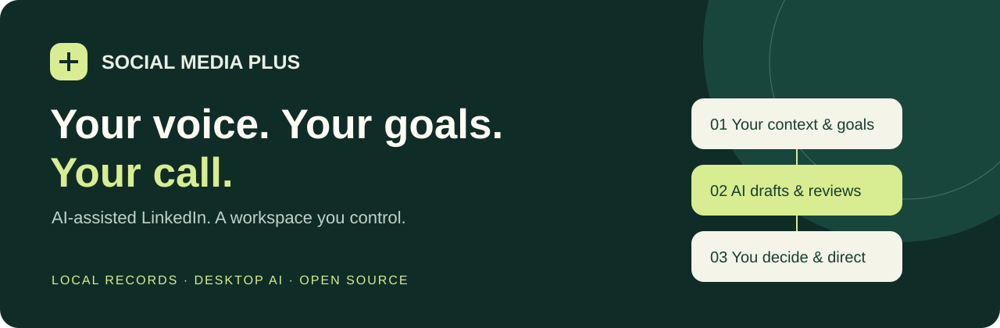
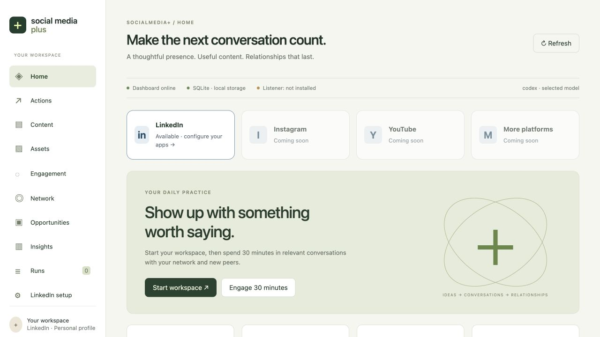
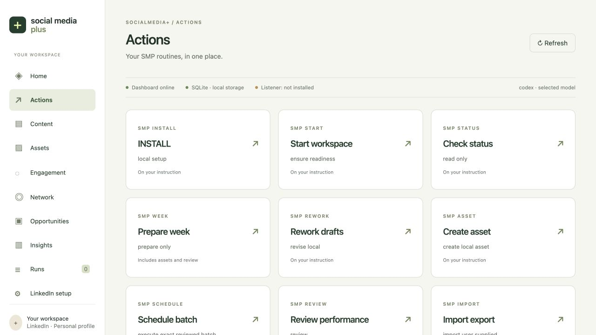
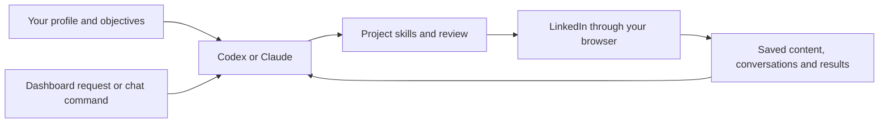
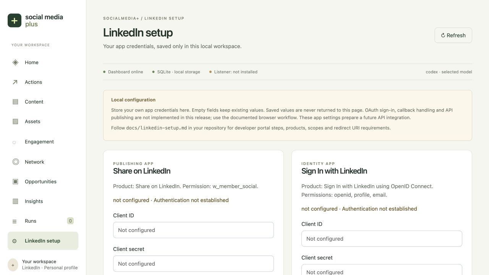

# Social Media Plus

**Social Media Plus is an open-source platform for automating social media activities through your desktop AI copilot.** It gives Codex or Anthropic’s Claude Desktop / Cowork the workflows, dashboard and local records to find relevant people, join conversations, write content, publish and schedule through your signed-in browser.

🚀 **LinkedIn is available at launch. Instagram, YouTube and other platform integrations are under development and coming soon.** The workflows below describe what you can do with LinkedIn today.

Your copilot uses your profile, niche, audience and objectives to decide which topics and people are relevant. It reads the discussion before commenting, uses your writing preferences when drafting, and saves what it did so the next session can continue from there.

The AI operates LinkedIn’s visible interface through the browser tools available in your desktop session. That includes its post and article editors and native scheduling controls, where available for your account and content format. The current workflow does not require a LinkedIn API integration or a separate LLM API key.

**[🚀 Initial setup](docs/getting-started.md) · [⌨️ Commands](SOCIAL_MEDIA_PLUS.md) · [🎨 Personalize](docs/personalization.md) · [📖 How the workflows work](docs/how-it-works.md)**



## 💬 What you can use it for

| Activity | What your copilot does |
| --- | --- |
| Find relevant people | Looks for people and current discussions that fit your niche, audience and objectives. Saves observed context for later sessions. |
| Engage your network | Reads posts from existing connections and observed followers, checks your interaction history, and writes relevant comments and replies. |
| Continue conversations | Revisits recorded threads, checks for visible replies, and responds within the session you requested. |
| Create content | Researches topics, drafts posts and native articles, creates final image and carousel PDF assets, and reviews the work against your voice and evidence. Asset creation uses available host tools. |
| Publish and schedule | Opens LinkedIn in your signed-in browser, submits the exact content you authorized, and checks the published item or native schedule. |
| Like and repost | Uses `SMP ENGAGE+` for selective likes and occasional attributed reposts with your perspective. |
| Track opportunities | Records relevant hiring opportunities and contact evidence. Optional recruiter outreach requires your own goals, résumé and explicit setup. |
| Review results | Keeps content versions, observed comments/replies, action receipts and supplied metrics so you can review outcomes and follow up. |

You can request a 30-minute engagement session, focus only on replies, or prepare a full week of content. The [command guide](SOCIAL_MEDIA_PLUS.md) explains each mode and what it authorizes.

Browser actions require a compatible host tool and your signed-in account. See [release verification](docs/release-verification.md) for what has been tested; verify browser access and scheduled request pickup in your own installation. Follow-up happens during requested sessions; the package does not continuously watch every comment or collect a complete follower roster. Sharing into LinkedIn Groups has no dedicated workflow in this release. The relationship groups in local records are organizational categories.

## 🖥️ One dashboard for the work

The dashboard brings the records together:

- **Content and Assets:** drafts, revisions, articles, images and documents associated with your content.
- **Engagement and Network:** recorded actions, observed relationships and conversation history.
- **Opportunities:** saved openings and the evidence behind a potential match.
- **Insights:** analysis of available observations and imported metrics.
- **Runs:** the requests you made, their progress and their recorded results.

Choose an operation on the Actions screen or type its command in the project chat. Both use the same workspace.



## 🧠 What the AI does, and what this project provides

Your desktop copilot does the reasoning and browser work. Social Media Plus supplies the instructions and records it needs: your profile, writing preferences, content history, relationships, action scope and follow-ups. The included skills cover the workflows; five review roles help check substantial drafts.



For example, `SMP NETWORK 30` asks your copilot to spend a bounded session engaging existing connections and observed followers. It checks the saved history, reads relevant current discussions, sends comments or replies within that scope, then records confirmed results. A later session uses those records when deciding where to follow up.

The local application uses Python and SQLite. No PostgreSQL, Postiz or Docker is needed. The MCP server connects your assistant to local status and queued requests; it is not a LinkedIn API connector. Read [how it works](docs/how-it-works.md) for the complete flow or [architecture](docs/architecture.md) for implementation details.

## 🎛️ You set the scope

Choose the audience, objectives, tone, time budget and actions you want. Use `SMP ENGAGE 30 preview` for suggestions without sending anything. Use `SMP ENGAGE 30` when you want the copilot to select and send contextual comments and replies during that session, without asking you to approve each comment. The duration is a limit, not an action quota; a session may find nothing suitable to send.

For content, `SMP WEEK` prepares a batch. Review it, request edits, then use `SMP SCHEDULE` to authorize the finished text, assets, destination and times. The agent checks LinkedIn’s actual result before recording an item as published or scheduled. An uncertain submission stays unresolved until checked, so a retry does not blindly send it again.

Installing the project grants no standing permission to publish or contact people. Your copilot performs the browser actions under the scope you requested.

## 🎨 Set your profile, audience and objectives

Tell your copilot what you do, which niche you work in, who you want to reach and what you want those conversations to achieve. These choices guide both content and engagement. Supply a few writing samples, set the tone you prefer and name any topics or details that must stay private. Correct a draft and ask the copilot to save the preference for next time.

| Personalize | Examples | Private working file created on install |
| --- | --- | --- |
| Objectives and audience | Peer conversations, teaching, professional visibility, relevant readers | `profile/profile.json` |
| Professional context | Topics you know, experience you can share, exclusions | `profile/context.md` |
| Tone and style | Warm or formal, paragraph length, humor, phrases to avoid | `profile/voice.md` |
| Evidence | Sources, caveats and verified wording for personal claims | `profile/claims.json` |
| Public boundaries | Confidential topics, private career plans, review requirements | `profile/editorial-policy.md` |
| Rhythm and content mix | Timezone, weekly frequency, pillars and posting windows | `config/settings.json` |

For example: “Write in plain language for product leads. Use specific examples, avoid sales phrasing, and keep client details private.” Your preference should guide the writing without inventing experiences or results.

**[Read the personalization guide](docs/personalization.md)** for a starter prompt, file links and a way to test the fit. A résumé is optional unless you choose a workflow that needs one.

## 🚀 Get started

You need **Python 3.11+** and a compatible desktop agent with access to your local folder. A compiled dashboard is included. See [prerequisites](docs/prerequisites.md) for host and platform limits.

```sh
git clone https://github.com/gpsintown/SocialMedia-Plus.git
cd SocialMedia-Plus
```

Open that folder in your desktop agent, then send this in the project chat:

```text
Read AGENTS.md and SOCIAL_MEDIA_PLUS.md in this folder. SMP INSTALL
```

The agent creates your private workspace, starts the dashboard and prepares local tool registration. It connects and verifies those tools where your host supports them. Where the host supports scheduling, it also sets up a recurring check for dashboard requests. Open [localhost:4010](http://127.0.0.1:4010) and verify a harmless STATUS request is processed. If scheduled pickup is unavailable, use `SMP RUN QUEUE` in chat.

**Follow the [complete initial setup guide](docs/getting-started.md)** for each step, including verification and your first preview.

| Setup resource | Purpose |
| --- | --- |
| [Codex setup](docs/codex-setup.md) | Local project, skills, MCP and host scheduling |
| [Claude Desktop / Cowork setup](docs/claude-setup.md) | Folder access and Claude-specific setup |
| [Optional LinkedIn developer setup](docs/linkedin-setup.md) | Prepare future API settings: two apps, products and permissions |
| [Queue listener setup](docs/listener.md) | Scheduled pickup, verification and manual fallback |
| [Personalization guide](docs/personalization.md) | Your profile, voice, objectives and privacy boundaries |

<details>
<summary>⌨️ Prefer terminal initialization?</summary>

```sh
python3 scripts/smp-install.py --root . --host codex
python3 scripts/smp-start.py --root .
```

Use `--host claude` for Claude. The installer initializes local files and generates setup material; it cannot create a desktop scheduled task by itself. Complete the host and listener instructions above.

</details>

GitHub Desktop can clone and manage this repository; it is not the AI runtime. Local scheduled work requires the computer and necessary desktop app to remain available. The listener is host-managed polling, not an independent AI daemon.

## ⌨️ Your everyday commands

These are **chat instructions**, not shell commands. Read the [complete command guide](SOCIAL_MEDIA_PLUS.md) for parameters, action scopes and optional modes. The [machine-readable command map](config/chat-commands.json) records dispatch rules.

| Command | What it does |
| --- | --- |
| `SMP INSTALL` | Initialize the workspace and configure the host |
| `SMP START` | Resume context in the same project folder |
| `SMP STATUS` | Inspect workspace status |
| `SMP WEEK <Monday date>` | Prepare a reviewable week of content |
| `SMP REWORK <week or item>` | Revise an existing batch or item |
| `SMP SCHEDULE <week or item>` | Authorize the exact finished content for scheduling |
| `SMP ENGAGE 30 preview` | Prepare a conversation shortlist and reply drafts; send nothing |
| `SMP ENGAGE 30` | Read relevant discussions and send contextual comments/replies for the session |
| `SMP NETWORK 30` | Focus on existing connections and observed followers |
| `SMP DISCOVER 30` | Find relevant new people and discussions |
| `SMP REPLIES 30` | Check visible replies in conversations already joined and respond |
| `SMP ENGAGE+ 30` | Add selective likes and occasional attributed reposts |
| `SMP RECRUITER+ 30` | Run the optional configured hiring outreach workflow |
| `SMP REVIEW <Monday date>` | Review available outcomes and lessons |
| `SMP RUN QUEUE` | Process pending dashboard requests in the current host session |

Each week, start the workspace, prepare your content with WEEK, review it and request SCHEDULE. For daily engagement, use START followed by ENGAGE 30. Add `preview` when you only want suggestions.

## 🔗 LinkedIn developer settings are optional

The current browser workflow uses your own signed-in LinkedIn session. You can also save two sets of developer-app settings for future API adapters. Follow the [LinkedIn developer guide](docs/linkedin-setup.md) for app creation, products and permissions.



Saving these fields stores configuration in private `.env.local`. It does not complete OAuth or enable API publishing. You can skip this step for browser work.

## 🗂️ Explore the project

| Location | Purpose |
| --- | --- |
| [`SOCIAL_MEDIA_PLUS.md`](SOCIAL_MEDIA_PLUS.md) | Main operating and command guide |
| [`AGENTS.md`](AGENTS.md), [`CLAUDE.md`](CLAUDE.md) | Desktop agent entry instructions |
| [`src/`](src/), [`scripts/`](scripts/) | Python records, local server, installer and MCP |
| [`ui/src/`](ui/src/), [`ui/dist/`](ui/dist/) | Editable dashboard and ready-to-run build |
| [`.agents/skills/`](.agents/skills/) | Codex skills and common workflow entry points |
| [`.claude/skills/`](.claude/skills/), [`.claude/agents/`](.claude/agents/) | Claude skills and council roles |
| [`templates/`](templates/) | Blank profile and configuration defaults |
| [`workflows/`](workflows/), [`docs/`](docs/) | Operational workflows and setup documentation |
| [`tests/`](tests/) | Tests using isolated temporary workspaces |
| `profile/`, `data/`, `runtime/` | Private working files created on install; ignored by Git |

See [architecture](docs/architecture.md) for the queue, file notification, SQLite and MCP flow, and [council review](docs/council.md) for the review roles and host limits.

## 🔒 Privacy and sharing

The public project ships blank templates. Your workspace is stored locally, but your chosen AI host and browser services may process the context you supply under their account settings; the model does not necessarily run offline. Your populated profile, résumé, credentials, database, imports and runtime state belong in your private workspace. **Commit `.env.example`, never a populated `.env.local`.**

To prepare a clean source export:

```sh
python3 scripts/release-check.py
python3 scripts/build-release.py --output ../social-media-plus-source.zip
```

The export uses a public file allowlist and includes a SHA-256 manifest. The scanner detects common credential patterns; review the exported files for personal information before sharing. Do not publish the history of a populated private workspace.

Read [security](SECURITY.md), [contributing](CONTRIBUTING.md) and [third-party notices](THIRD_PARTY_NOTICES.md).

## 🌱 What's next

- Direct LinkedIn OAuth, API publishing and analytics adapters.
- Instagram, YouTube and other platform integrations are under development.
- Further improvements to onboarding and desktop-host integration.

These integrations are not available in the current release. Contributions and focused issues are welcome. See [CONTRIBUTING.md](CONTRIBUTING.md).

---

Built as an open-source project by [gpsintown](https://github.com/gpsintown). [MIT licensed](LICENSE), with preserved notices for included third-party material. Independent community project; not affiliated with LinkedIn, OpenAI or Anthropic.
