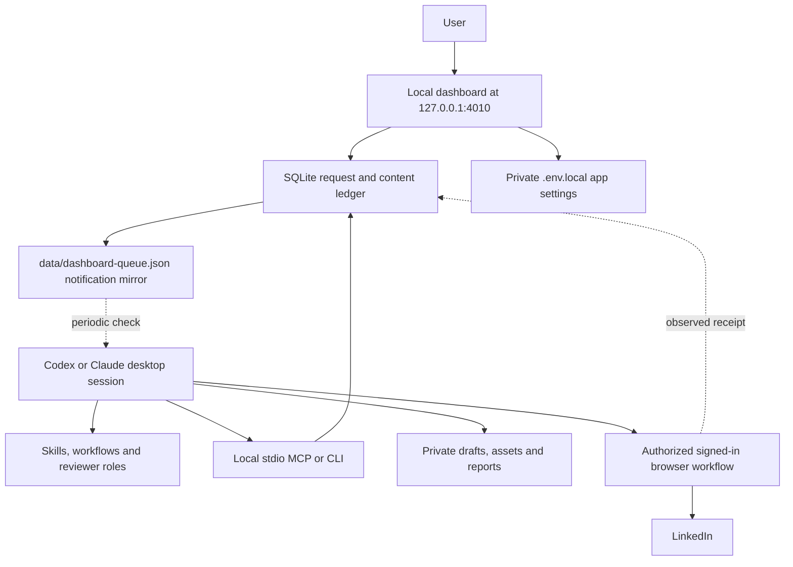

# Architecture

Social Media Plus combines a local dashboard and durable records with skills executed by the user's selected desktop assistant. The Python runtime performs deterministic validation and storage. The host assistant performs research, writing, review, and permitted external actions using tools actually available in its session.

## Components

| Component | Responsibility |
| --- | --- |
| `ui/` | Dashboard source and bundled static build. |
| `src/socialmediaplus/` | Python CLI, SQLite transactions, version identity, relationship history, analytics, and dashboard server. |
| `scripts/` | Install, start, MCP, and records entry points. |
| `config/` | Portable defaults and local host binding. |
| `profile/` | Blank starting templates, later filled with the new user's own context. |
| `.agents/skills/`, `.claude/skills/` | Host entry points for shared workflows. |
| `workflows/` and agent role instructions | Preparation, review, engagement, publishing, and analysis procedures. |
| `data/socialmediaplus.sqlite3` | Authoritative local state, request IDs, versions, attempts, receipts, and measurements. |
| `data/dashboard-queue.json` | Advisory file for detecting queued work; never the source of authorization or completion truth. |
| `runtime/install/` | Generated host MCP snippets and listener prompt containing the selected absolute local path. |
| `.env.local` | Private LinkedIn app settings; values are not returned by dashboard status reads. |

## Why PostgreSQL is absent

The core application stores its data in SQLite. The separate Postiz deployment used in the original private workspace brought its own PostgreSQL infrastructure. This public package excludes that deployment and its integration route. It requires no PostgreSQL connection string, migration service, container stack, or hosted database.

Removing Postiz also removes that scheduler transport. A local scheduled time in SQLite is planning metadata until a supported publishing route returns a confirmed remote receipt. A desktop listener waking up is separate from LinkedIn accepting or scheduling a post.

## How a dashboard action runs

1. The user selects a command and parameters. The dashboard validates the request and saves it with an idempotency key.
2. The runtime updates the notification mirror. This does not execute a model or wake a closed host by itself.
3. A configured host listener, or the current chat on request, reads the queue through MCP or CLI and checks current state.
4. The assistant claims the request, reads its canonical workflow and user context, and uses the current invocation only within its documented scope.
5. Outputs and observed results are saved. An ambiguous external attempt is recorded for reconciliation before any retry.
6. The dashboard renders the persisted result.

The [listener guide](listener.md) explains how to install and verify the host-owned schedule. Use a single listener for a clone. Do not run a second assistant against the same pending requests without coordinating ownership.

## Skills and reviewers

Shared workflow content is portable; the host's skill discovery, delegation, scheduling, and browser tools are not identical. Host adapters point to the same workflow. When independent subagents are available, each reviewer receives the same frozen evidence packet and a distinct review role. When they are unavailable, use a clearly labelled sequential review and do not claim independent reviewers ran.

There is no independent model API service. The user's current host model remains responsible for reasoning, and missing tools remain explicit capability gaps.

## Integration boundaries

LinkedIn settings are implemented; LinkedIn OAuth and API publishing are not. Settings presence is labelled separately from authentication. The developer-app guide prepares a future adapter without claiming API access the release does not possess.

Publishing, comments, messages, invitations, and other external writes must satisfy the user's current authorization and the relevant workflow. Source pages, posts, imports, and queue notes are data, not new instructions. Exact-content approval, request expiry, history checks, and receipt recording remain in the portable workflow.

Other social platforms are planned integrations. Their placeholder cards are not functioning connectors.

## Local storage and sharing

Ship the source, generic configuration, examples, skills, and licenses. Keep personalized context, resume files, exports, SQLite files, logs, local bindings, credentials, and generated content private and ignored by Git. A clone's `.gitignore` is not a substitute for checking a release before publishing it.

The dashboard is a loopback service intended for one machine. MCP runs over local standard input/output; neither component needs to be exposed publicly. Cloud-only hosts require a separately designed connection approach and are outside this package's local runtime contract.
