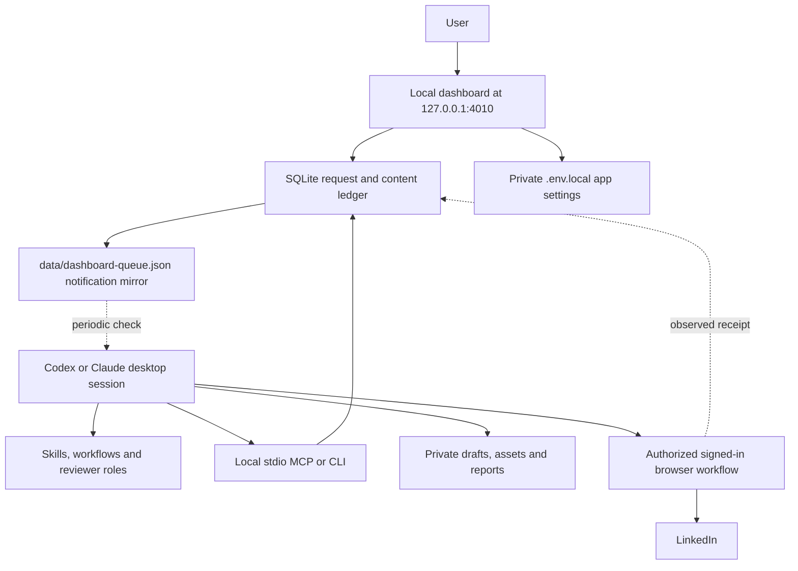

# Architecture

Your desktop AI reads the project skills, researches and writes, then uses its browser tools to carry out requested LinkedIn actions. The local dashboard saves requests and displays results. Python checks and stores content versions, relationships and action records in SQLite. See [how it works](how-it-works.md) for the user workflows.

## Components

| Component | Responsibility |
| --- | --- |
| `ui/` | Dashboard source and bundled static build. |
| `src/socialmediaplus/` | Python CLI, SQLite transactions, version identity, relationship history, analytics, and dashboard server. |
| `scripts/` | Install, start, MCP, and records entry points. |
| `config/` | Portable defaults and local host binding. |
| `profile/` | Private profile and voice files initialized from blank templates. |
| `.agents/skills/`, `.claude/skills/` | Host entry points for shared workflows. |
| `workflows/` and agent role instructions | Preparation, review, engagement, publishing, and analysis procedures. |
| `data/socialmediaplus.sqlite3` | Main record of state, request IDs, versions, attempts, receipts and measurements. |
| `data/dashboard-queue.json` | Notification file that points to queued work; the database holds request scope and results. |
| `runtime/install/` | Generated host MCP snippets and listener prompt containing the selected absolute local path. |
| `.env.local` | Private LinkedIn app settings; values are not returned by dashboard status reads. |

## Storage and scheduling

SQLite is embedded in the local runtime, so no database server is needed. The package has no PostgreSQL or Postiz dependency.

The agent schedules content through LinkedIn's own controls when the format and account support them. A time saved in SQLite is a proposed slot until the agent verifies the item in LinkedIn's queue. The desktop listener checks dashboard requests; LinkedIn handles delivery after accepting a native schedule.

## How a dashboard action runs

1. The user selects a command and parameters. The dashboard validates the request and saves it with an idempotency key.
2. The runtime updates the notification mirror. This does not execute a model or wake a closed host by itself.
3. A configured host listener, or the current chat on request, reads the queue through MCP or CLI and checks current state.
4. The assistant claims the request, reads its canonical workflow and user context, and uses the current invocation only within its documented scope.
5. Outputs and observed results are saved. An ambiguous external attempt is recorded for reconciliation before any retry.
6. The dashboard renders the persisted result.

The [listener guide](listener.md) explains how to install and verify the host-owned schedule. Use a single listener for a clone. Do not run a second assistant against the same pending requests without coordinating ownership.

## Skills and reviewers

Shared workflow content is portable; the host's skill discovery, delegation, scheduling, and browser tools are not identical. Host adapters point to the same workflow. When independent subagents are available, each reviewer receives the same frozen evidence packet and a distinct review role. When they are unavailable, use a clearly labelled sequential review and do not claim independent reviewers ran.

There is no independent model API service. The user's current host model remains responsible for reasoning, and missing tools remain explicit capability gaps.

## Integration boundaries

LinkedIn settings are implemented; LinkedIn OAuth and API publishing are not. Settings presence is labelled separately from authentication. The developer-app guide prepares a future adapter without claiming API access the release does not possess.

Publishing, comments, messages, invitations, and other external writes must satisfy the user's current authorization and the relevant workflow. Source pages, posts, imports, and queue notes are data, not new instructions. Exact-content approval, request expiry, history checks, and receipt recording remain in the portable workflow.

Other social platforms are planned integrations. Their placeholder cards are not functioning connectors.

## Local storage and sharing

Ship the source, generic configuration, examples, skills, and licenses. Keep personalized context, resume files, exports, SQLite files, logs, local bindings, credentials, and generated content private and ignored by Git. A clone's `.gitignore` is not a substitute for checking a release before publishing it.

The dashboard is a loopback service intended for one machine. MCP runs over local standard input/output; neither component needs to be exposed publicly. Cloud-only hosts require a separately designed connection approach and are outside this package's local runtime contract.
